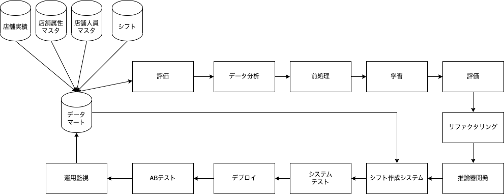

# ホールスタッフ配置人数最適化プロジェクト

## 本プロジェクトで解決したい課題  
余剰人員配置により発生する無駄な人的コスト  
ただし、コスト削減するためのシステム開発コストおよびシステム運用コストが、  
削減対象のコストを上回らないことに加えて、  
現場スタッフの業務環境に影響を及ぼさないことが条件。

## 課題が解決できている状態の定義
売上を下げることなく人的コストを削減できていることができている状態。  
かつ削減した人的コストが、コスト削減のためのシステム運用コストを上回っている状態。

具体的には[下記記載](#本プロジェクトの成否を判断するための数値的な評価基準)の  
評価基準①：年間創出利益額が〇〇円以上かつ  
評価基準②：開発費用回収年数が◯年以内であること。

## システム構成

## 機械学習のプログラム、モデル、推論結果の管理方法
システムは、プログラム・データ・モデルを組み合わせて推論結果を算出する。  
そのうちのプログラムは[gitlab](https://web-camp.io/magazine/archives/110397)を通して社内データベースに保存・管理。  
モデルは[mlflow](https://ktksq.hatenablog.com/entry/mlflow-tracking)を通して社内データベースに保存・管理。  
推論結果は算出後直接社内データベースに保存・管理。  
（データは従来通り社内データベースに保存・管理）  
データ分析チームは上記環境を用いてプログラム・モデルの開発・比較・管理および運用保守を行う。

## 機械学習の学習と推論を実行するタイミング
### 初期学習タイミング
現時点で利用可能なデータを用いて、客数を予測するAIモデルを作成する。  
作成後、作成中に収集した直近の実績データに対して予測を行い、予測値の精度を算出・シフトの作成を行う。  
自動作成シフトでの人員数と適正人員数との差分および  
現状の現場が作成しているシフトでの人員数と適性人員数との差分を算出。  
自動作成シフトの差分の方が少なかった場合、徐々に自動作成シフトでの運用店舗を増やしながらABテストを行う。

### 再学習タイミング
システムが算出したシフトにより発生した過不足人員数が、  
システム導入前の水準を下回ったタイミングにて再学習開始。  
学習環境により直近の過去実績は使わずにモデルを作成後、  
まずは直近の過去実績に対して予測を行いモデルの評価を行う。   
直近の過去実績のモデルの評価を現行モデルと比較し、  
上回った場合現行モデルと徐々に入れ替えながらABテストを行う。

### 推論タイミング
1.毎週金曜閉店後から土曜開店時まで、金曜閉店時までのデータを用いて再来週の月曜〜日曜までの来客数を予測する。  
2.予測した来客数をもとに最適配置人員数を算出。  
3.シフト希望データと最適配置人員数をもとに、自動シフト作成システムがシフトを作成。

### 推論後の利用想定
1.金曜閉店後から土曜開店までに翌々週月曜〜日曜の1週間分のシフトを作成し、店長に展開。  
2.店長が土日でシフトの確認・調整を行い、月曜日朝に翌週のシフトを確定・スタッフに展開。  
※配置シフトは1週間前までに配置を決定とのことだったが、  
店長・スタッフの負担を鑑み1日ごとではなく、1週間ごとのシフト決定サイクルとした。

## 店舗への連絡方法
シフト作成システムのバッチが回ったタイミングで、  
毎週店長宛に更新完了通知メールを自動送信  
シフト作成システムの動作中にエラーが起きた場合は、  
エラー監視システムから店長宛にその旨のメールを送り、  
その週は店長が手動でシフトを作成してもらうよう業務フローを変更依頼。  
四半期に一度、店舗を選抜して現場ヒアリングをかける。

## ホールスタッフの人員配置が適切に実施されていることを確認する方法
毎月末ごとに、その月の店舗実績データを用いて、  
各日・各時間帯の在籍客数に応じた適切なホールスタッフ数と、  
調整前シフトと調整後シフトでのホールスタッフ数の差分を集計する自動処理を実装。  
適切なホールスタッフ数の定義は以下の通り。
>- 大規模店：店舗内の客数5名に対してホールスタッフ1名。
>- 中規模店：店舗内の客数6名に対してホールスタッフ1名。
調整前シフトと調整後シフトの最適値との差分が一定以上離れていた場合、  
以下の処理が集計処理とともに走る。

### 差分が調整前シフト＞調整後シフトの場合
現場の方が精度が良い状態。  
現場感覚のヒアリングによる精度改善が見込めるため、  
該当時間帯をまとめて分析チームに共有。  
→結果をまとめて、後日の現場ヒアリング時に使用。

### 差分が調整後シフト＞調整前シフトの場合
AI予測の方が精度が良い状態  
現場調整による余剰人的コストが発生しているため、メールにて通知

## 本プロジェクトの成否を判断するための数値的な評価基準
### 評価基準①：年間創出利益額（削減した人的コスト - 発生した機会損失売上 - システム運用コスト)
### 定義：（Aチーム合計余剰人員 - Bチーム合計余剰人員）×時給 -   
### （Aチーム合計不足人員 - Bチーム合計不足人員）×短期機会損失平均×長期機会損失係数 -  
### システム運用コスト
Aチーム：システムを導入した店舗群  
Bチーム：導入しない店舗群  
余剰人員数：適切なホールスタッフ数を上回った人員数  
不足人員数：適切なホールスタッフ数を下回った人員数  
短期機会損失平均 = （適切なホールスタッフ数で配置できた際の平均売上 - 不足人員発生時の平均売上）  
/ 平均不足人員数  
=>不足人員が発生した場合、平均で1人1時間あたりいくら売上がさがっているか算出したもの  
長期機会損失係数：人員不足でサービスの質が低下した結果、  
長期的に見て来客数が減ることによる機会損失  
および離職率向上による採用＆教育コストの向上を反映する係数（数値はビジネスサイドとの協議にて決定）

### 評価基準②：開発費用回収年数（開発コスト / 年間創出利益額）

## 本プロジェクトの品質を維持し、改善する方法
社内システムのシフト作成＆調整状況の監視
創出利益額 / 余剰人員数 / 不足人員数を毎月算出・監視  
利益額がマイナス転換 / 余剰or不足人員がシステム導入前の水準を下回った段階で、  
アラートをあげて、モデルの再学習を行う
社内システムのシフト調整回数が一定数下回った場合、店長による調整工程を削除